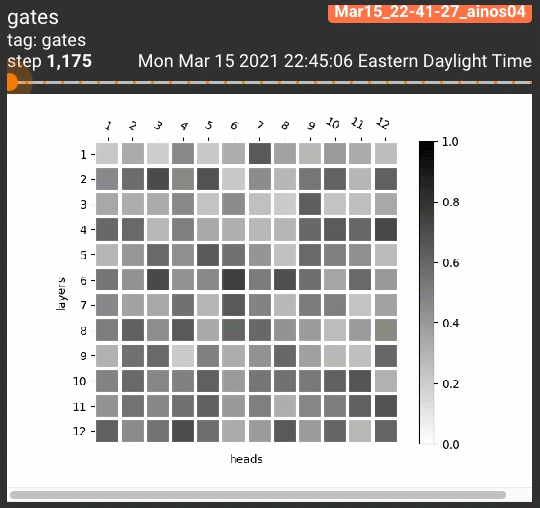
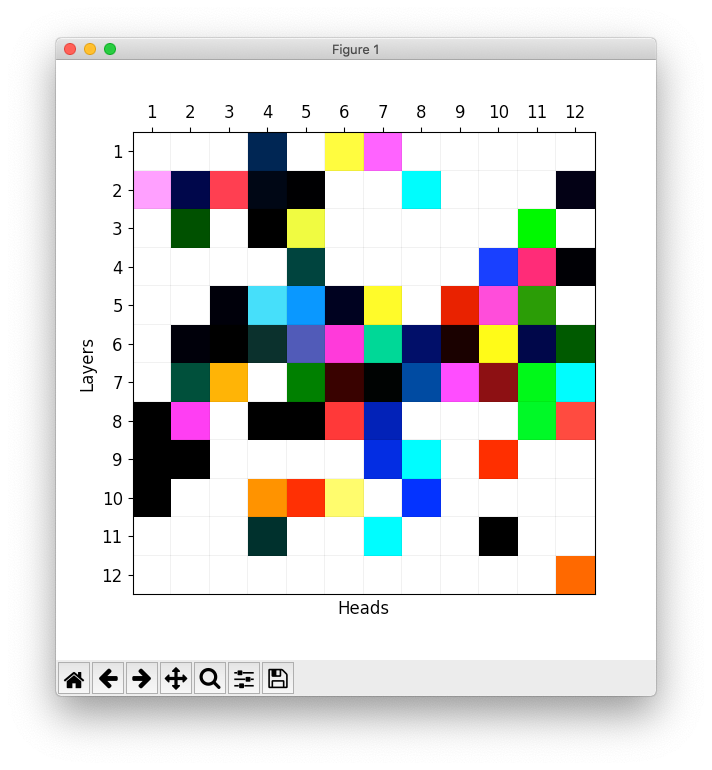
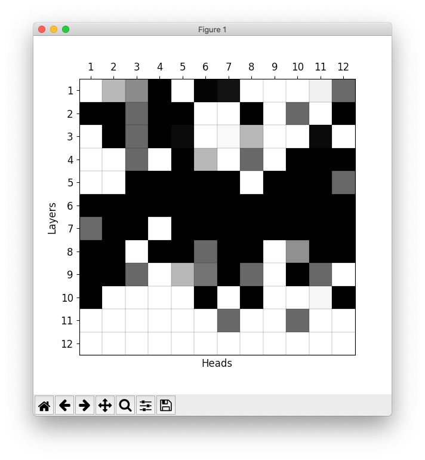
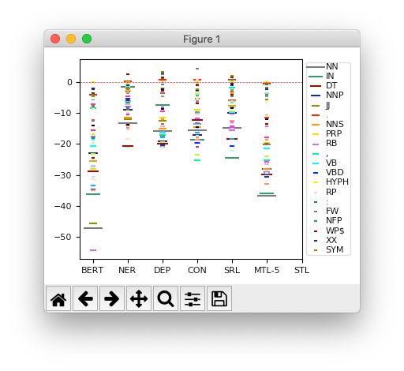
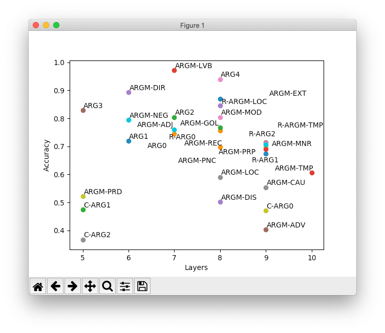

# The Stem Cell Hypothesis

Codes for our paper *[The Stem Cell Hypothesis: Dilemma behind Multi-Task Learning with Transformer Encoders](https://arxiv.org/abs/2109.06939)* published to [EMNLP 2021: The 2021 Conference on Empirical Methods in Natural Language Processing](https://2021.emnlp.org/). 

## Installation

Run the following setup script. Feel free to install [a GPU-enabled PyTorch](https://pytorch.org/get-started/locally/) (`torch>=1.6.0`).

```bash
python3 -m venv env
source env/bin/activate
ln -sf "$(which python2)" env/bin/python
pip install -e .
```

## Data Pre-processing

Download OntoNotes 5 ([`LDC2013T19.tgz`](https://catalog.ldc.upenn.edu/LDC2013T19)) and put it into the following directory:

```bash
mkdir -p ~/.elit/thirdparty/catalog.ldc.upenn.edu/LDC2013T19/
cp LDC2013T19.tgz ~/.elit/thirdparty/catalog.ldc.upenn.edu/LDC2013T19/LDC2013T19.tgz
```

That's all. ELIT will automatically do the rest for you the first time you run the training script.

## Experiments

Here we demonstrate how to experiment with BERT-base but feel free to replace the transformer and task name in the script path for other experiments. Our scripts are grouped by transformers and tasks with clear semantics.

### Single Task Learning

The following script will train STL-POS with BERT-base and evaluate its performance on the test set:

```bash
python3 stem_cell_hypothesis/en_bert_base/single/pos.py
```

### Multi-Task Learning

The following script will train MTL-5 with BERT-base and evaluate its performance on the test set:

```bash
python3 stem_cell_hypothesis/en_bert_base/joint/all.py
```

### Pruning Experiments

The following script will train STL-POS-DP with BERT-base and evaluate its performance on the test set:

```bash
python3 stem_cell_hypothesis/en_bert_base/gate/pos.py
```

You can monitor the pruning process in real time via tensorboard:

```bash
tensorboard --logdir=data/model/mtl/ontonotes_bert_base_en/gated/pos/0/runs --samples_per_plugin images=1000
```

which will show how the heads gradually get claimed in http://localhost:6007/#images:



Once 3 runs are finished, you can visualize the overlap of head utilization across runs via:

```bash
python3 stem_cell_hypothesis/en_bert_base/gate/vis_gate_overlap_rgb.py
```

which will generate the following figure (1a):



Similarly, Figure 1g is generated with `stem_cell_hypothesis/en_bert_base/gate/vis_gate_overlap_tasks_gray.py`.



### Probing Experiments

Once a model is trained, you can probe its representations via the scripts in `stem_cell_hypothesis/en_bert_base/head`. For example, to probe STL-POS performance, run:

```bash
python3 stem_cell_hypothesis/en_bert_base/head/pos.py
python3 stem_cell_hypothesis/en_bert_base/head/vis/pos.py
```

which generates Figure 4:



You may need to manually change the path and update new results in the scripts.

To probe the unsupervised BERT performance for a single task, e.g., SRL, run:

```bash
python3 stem_cell_hypothesis/en_bert_base/head/srl_dot.py
```

which generates Figure 3:



Although not included in the paper due to page limitation, experiments of Chinese, BERT-large, ALBERT, etc. are uploaded to `stem_cell_hypothesis`. Feel free to run them for your interest.

## Citation

If you use this repository in your research, please kindly cite our EMNLP2021 paper:

```bibtex
@inproceedings{he-etal-2021-stem,
    title = "The Stem Cell Hypothesis: Dilemma behind Multi-Task Learning with Transformer Encoders",
    author = "He, Han and Choi, Jinho D.",
    booktitle = "Proceedings of the 2021 Conference on Empirical Methods in Natural Language Processing (EMNLP)",
    month = nov,
    year = "2021",
    address = "Online",
    publisher = "Association for Computational Linguistics",
    abstract = "Multi-task learning with transformer encoders (MTL) has emerged as a powerful technique to improve performance on closely-related tasks for both accuracy and efficiency while a question still remains whether or not it would perform as well on tasks that are distinct in nature. We first present MTL results on five NLP tasks, POS, NER, DEP, CON, and SRL, and depict its deficiency over single-task learning. We then conduct an extensive pruning analysis to show that a certain set of attention heads get claimed by most tasks during MTL, who interfere with one another to fine-tune those heads for their own objectives. Based on this finding, we propose the Stem Cell Hypothesis to reveal the existence of attention heads naturally talented for many tasks that cannot be jointly trained to create adequate embeddings for all of those tasks. Finally, we design novel parameter-free probes to justify our hypothesis and demonstrate how attention heads are transformed across the five tasks during MTL through label analysis.",
}
```